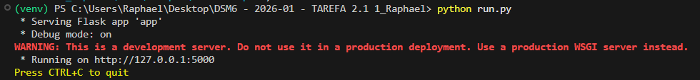
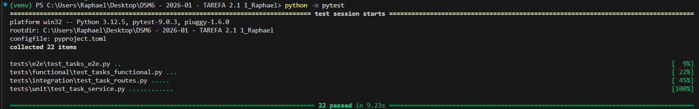
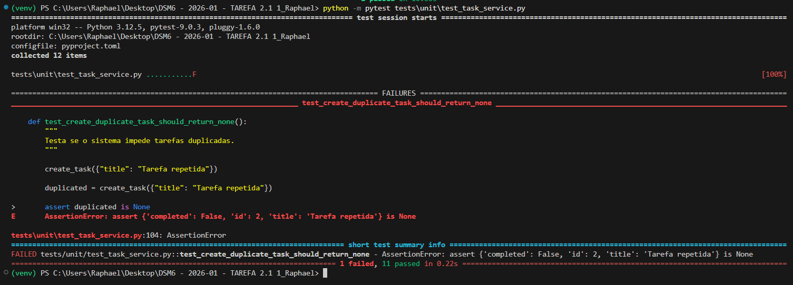
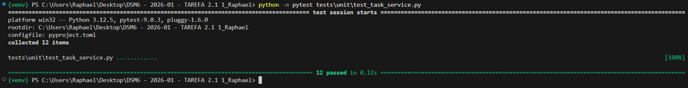

# Gerenciador de Notas — Qualidade e Testes de Software

Projeto desenvolvido para a disciplina **Qualidade e Testes de Software**, utilizando Flask, Pytest e Selenium para aplicação de testes automatizados em diferentes níveis da pirâmide de testes.

---

## Autor

**Jorge Massaru Hashiguchi da Silva**

Qualidade e Testes de Software

Professor: Maylon Henrique de Oliveira

---

## Objetivo

Desenvolver uma aplicação Web simples com Flask para gerenciamento de notas, aplicando na prática os conceitos de:

- Testes Unitários
- Testes de Integração
- Testes Funcionais
- Testes E2E (End-to-End) com Selenium
- TDD (Test Driven Development) — ciclo RED → GREEN → REFACTOR
- CI/CD com GitHub Actions
- Padronização de código com Black
- Análise estática com Flake8

---

## Tecnologias Utilizadas

- Python 3.12
- Flask
- Pytest
- Selenium + WebDriver Manager
- Black
- Flake8
- GitHub Actions

---

## Estrutura do Projeto

```text
.
├── app/
│   ├── routes/
│   │   ├── note_routes.py       # Rotas da API de notas
│   │   └── task_routes.py
│   ├── services/
│   │   ├── note_service.py      # Regras de negócio das notas
│   │   └── task_service.py
│   ├── templates/
│   │   ├── notes.html           # Interface web principal
│   │   └── tasks.html
│   └── __init__.py
│
├── tests/
│   ├── unit/
│   │   └── test_task_service.py
│   ├── integration/
│   │   └── test_task_routes.py
│   ├── functional/
│   │   └── test_tasks_functional.py
│   └── e2e/
│       └── test_tasks_e2e.py
│
├── imagens/
│   ├── tdd_red.png
│   ├── tdd_green.png
│   ├── app_running.png
│   ├── black_ok.png
│   ├── flake8_ok.png
│   ├── pytest_passed.png
│   └── github_actions.png
│
├── .github/
│   └── workflows/
│       └── test.yml
│
├── requirements.txt
├── pyproject.toml
├── .flake8
├── run.py
└── README.md
```

---

## Instalação

### 1. Clonar o repositório

```bash
git clone <URL_DO_REPOSITORIO>
cd Qualidade_e_Teste_de_Software_ATV2_DSM6-main
```

### 2. Criar e ativar ambiente virtual

```bash
python -m venv venv
```

**Windows (PowerShell):**

```powershell
Set-ExecutionPolicy -Scope Process -ExecutionPolicy RemoteSigned
.\\venv\\Scripts\\Activate.ps1
```

**Linux/macOS:**

```bash
source venv/bin/activate
```

### 3. Instalar dependências

```bash
pip install -r requirements.txt
```

---

## Executando a Aplicação

```bash
python run.py
```

Acesse em: `http://127.0.0.1:5000`



---

## Executando os Testes

### Todos os testes

```bash
python -m pytest
```

### Por nível

```bash
# Unitários
python -m pytest tests/unit

# Integração
python -m pytest tests/integration

# Funcionais
python -m pytest tests/functional

# E2E (requer o Flask rodando em outro terminal)
python -m pytest tests/e2e
```



---

## Pirâmide de Testes

| Nível       | Arquivo                          | Quantidade |
|-------------|----------------------------------|------------|
| Unitários   | `tests/unit/`                    | 23 testes  |
| Integração  | `tests/integration/`             | 10 testes  |
| Funcionais  | `tests/functional/`              | 6 testes   |
| E2E         | `tests/e2e/`                     | 4 testes   |
| **Total**   |                                  | **43 testes** |

---

## Funcionalidades da API

| Método | Rota                        | Descrição                        |
|--------|-----------------------------|----------------------------------|
| GET    | `/notes`                    | Lista todas as notas             |
| GET    | `/notes/<id>`               | Busca nota por ID                |
| POST   | `/notes`                    | Cria nova nota                   |
| PUT    | `/notes/<id>`               | Atualiza título/conteúdo         |
| DELETE | `/notes/<id>`               | Remove uma nota                  |
| PATCH  | `/notes/<id>/pin`           | Fixa uma nota                    |
| PATCH  | `/notes/<id>/unpin`         | Desfaz o destaque da nota        |
| GET    | `/notes/pinned`             | Lista notas fixadas              |
| GET    | `/notes/category/<cat>`     | Filtra notas por categoria       |
| GET    | `/notes/status`             | Verifica se a API está no ar     |

**Categorias válidas:** `pessoal`, `trabalho`, `estudo`, `ideia`, `outro`

---

## TDD — Test Driven Development

Foi aplicado o ciclo RED → GREEN → REFACTOR para as funcionalidades de **pin/unpin de notas** e **filtro por categoria**.

**Evidência RED** — teste falhando antes da implementação:



**Evidência GREEN** — teste passando após implementação:



---

## Padronização de Código

### Black

```bash
black .
```

​```
(venv) PS C:\Users\Jorge\Desktop\DSM6> black .
All done! ✨ 🍰 ✨
15 files left unchanged.
​```

(venv) PS C:\Users\Jorge\Desktop\DSM6>

### Flake8

```bash
flake8 .
```

​```
(venv) PS C:\Users\Jorge\Desktop\DSM6> flake8 .

(venv) PS C:\Users\Jorge\Desktop\DSM6>
​```

---

## CI/CD — GitHub Actions

A pipeline executa automaticamente a cada `push` ou `pull_request`:

1. Instala as dependências
2. Verifica formatação com **Black**
3. Analisa qualidade com **Flake8**
4. Executa todos os testes com **Pytest**

```yaml
name: Python Tests

on: [push, pull_request]

jobs:
  tests:
    runs-on: ubuntu-latest
    steps:
      - uses: actions/checkout@v4

      - name: Configurar Python
        uses: actions/setup-python@v5
        with:
          python-version: "3.12"

      - name: Instalar dependências
        run: |
          python -m pip install --upgrade pip
          pip install -r requirements.txt

      - name: Executar Black
        run: black --check .

      - name: Executar Flake8
        run: flake8 .

      - name: Executar Pytest
        run: pytest
```


